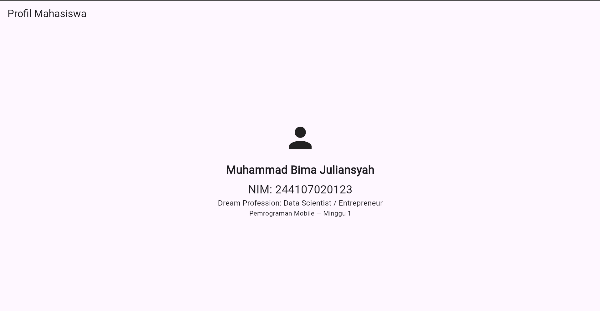

# Week 1 - Mobile Development Flutter Refresh

Week 1 Practicum we learn the basic of Dart and Flutter

### Mini Assignment Main Feature

The app contains an interface to display student data. It also use default widget like `Scaffold` and `SppBar` for the frame of main page. Beside that, it also use `Column` and `Center` to arrange the element UI vertically and to display things like ikon, names, NIM etc.

### Tech Stack

1. Flutter
2. Dart

### How to Run
1. Make sure Flutter SDK is installed and emluator or physical tool is running
2. Make sure you are in the right directory
5. To run the file, in this project you need to type `flutter run -t 01-week-1-mobile-development-ecosystem-flutter-refresh/lib/main.dart`

### Output

Student Profile app that display the student name, NIM and other detail, in this project it's dream profession

### Reflections
1. In what situation is native better that using cross platform?
- It is better to use native when you want a high control over your platform and when you need to access native API directly 

2. How can state change correlates with widget tree and declarative UI?
- In a declarative UI, the widget tree is just a visual reflection of the current state. When the state changes, Flutter does not manually edit the existing widgett, but instead, it rebuilds the affected parts of the widget tree to instantly display the new data
3. Why does small commit with clear message useful in teamwork and portfolio?
- Because clear commit message can give context or understanding of what those code do, it is also useful to track changes. Clear commit message is also useful in protfolio because it makes the portofolio easy to read and attractive to those who tries to recruit you or other people that is interested and whant to collaborate with you