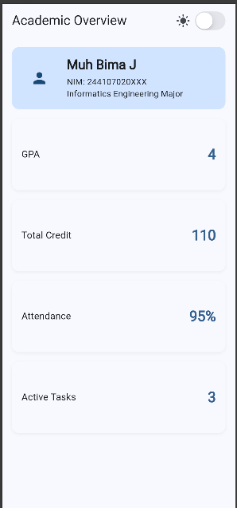
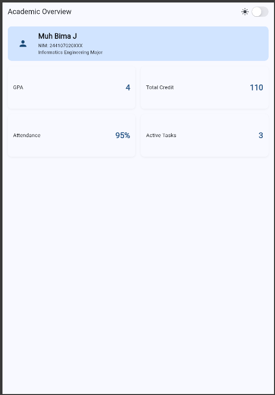
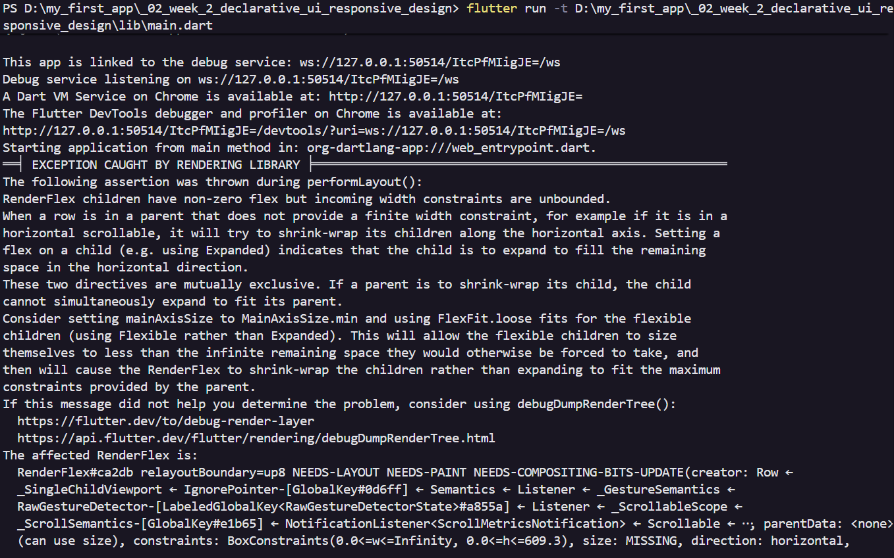
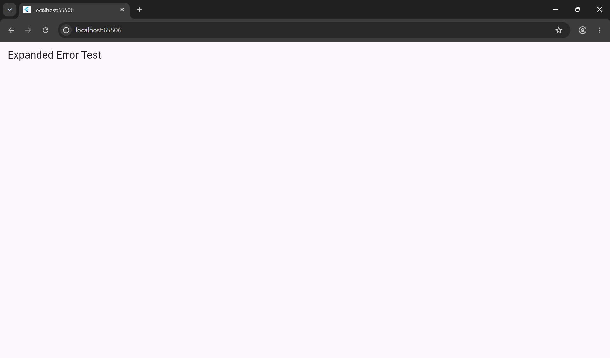

# Week 02 | Declarative UI & Responsive Design

## Simple Profile

Result

## StatefulWidget dan Cupertino Interaction

## Layout Experiment

1. Change breakpoint from 700 to other value and observe the change
- Breakpoint 700 in Ipad air 
- Breakpoint 900 in Ipad air  when we increase the breakpoint from 700 to 900 on larger display in this example ipad air, it will stay at 1 column for much longer until we change it to much larger display, then it will turn to 2 column, and it will work on reverse if we change the breakpoint smaller

2. Change themeMode to ThemeMode.dark, and to themeMode.system
-  
-  in this device, since the system is set to dark, so there are no difference between dark and system theme

3. Test your app with different emulator screen size
- Iphone 12 pro size (390x844) 
- Ipad air (820x1180) 

4. Add semantics or label that is important in screen reader
- I added semantics label `Togle dark mode` 

## Main Task

Narrow View
 

Wide View
 

## AI Challange

### 1. "Compare two academic dashboard layout for Flutter: `Gridview` verison and `LayoutBuilder` + `Column`. Explain the responsive trade-off and it's accesability".

- `GridView` is quick to set up responsive columns, but strict childAspectRatio rules lock card heights. If long text wraps on a small screen, the cards cannot expand vertically, causing overflow errorand forces screen readers into a rigid grid format (left-to-right, top-to-bottom), which can make audio navigation feel disjointed.

- `LayoutBuilder` + `Column` / `Wrap` is highly flexible. Because it doesn't rely on fixed aspect ratios, cards stretch vertically to fit wrapping text, completely eliminating overflow risks. It Mimics a natural top-to-bottom document. This linear flow makes tools like MergeSemantics highly effective, allowing screen readers to group and read information fluidly.

### 2. "Explain when does `Expanded` cause overflow in a row, give example of the failed code and the fix"

- `Expanded` causes layout failures in a Row when the Row is placed inside a horizontally scrollable parent, such as a horizontal `ListView` or `SingleChildScrollView`. Because a scrollable widget provides infinite horizontal space, the Row also has an infinite width constraint. Expanded tells its child to stretch and occupy "all remaining space." When "remaining space" is infinite, Flutter's layout engine cannot calculate the dimensions, throwing a RenderBox was not laid out or unbounded width exception.

Display
 

Terminal
 

### 3. AI audit. "Check again the above layout recommendation, is it still responsive under 600px, does it reduce accessability, and are there any widget that is not available in the current Flutter stable build?"

Partially, but it contains a critical flaw. The code I provided earlier used GridView.count with a fixed `childAspectRatio`: 3.0. While it successfully drops to 1 column under 600px, the fixed aspect ratio locks the card's height mathematically to its width. On very narrow screens (like an iPhone SE), the card becomes extremely short. If the text wraps to a second line, it will trigger a yellow-and-black overflow error because the card is not allowed to expand vertically. Every widget used in the provided code (LayoutBuilder, Semantics, ExcludeSemantics, CupertinoSwitch, GridView, Expanded, etc.) is fully available and foundational in the current Flutter stable build.