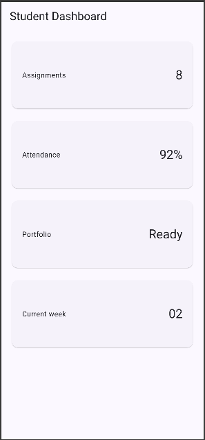
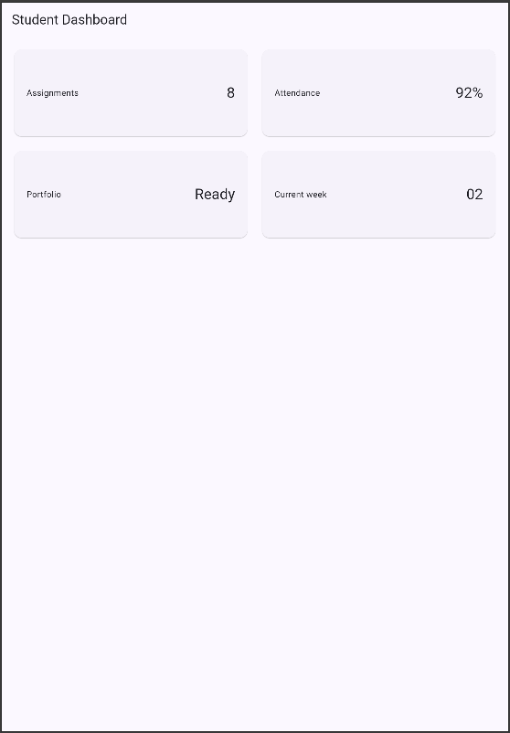
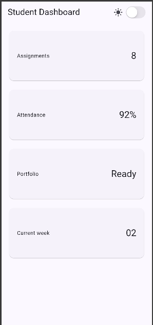
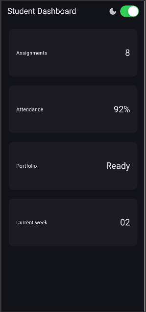
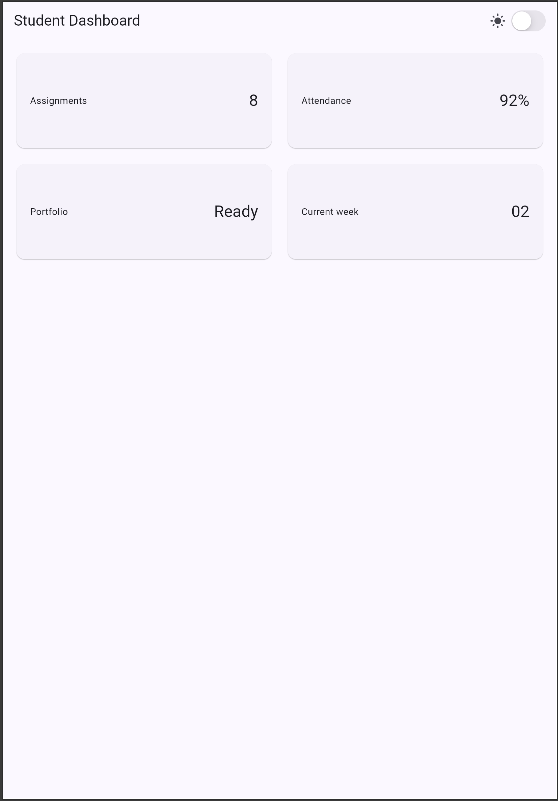
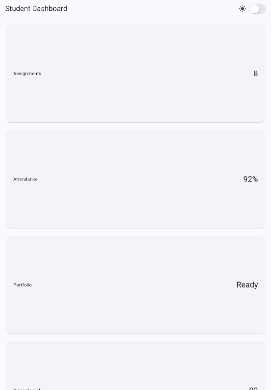
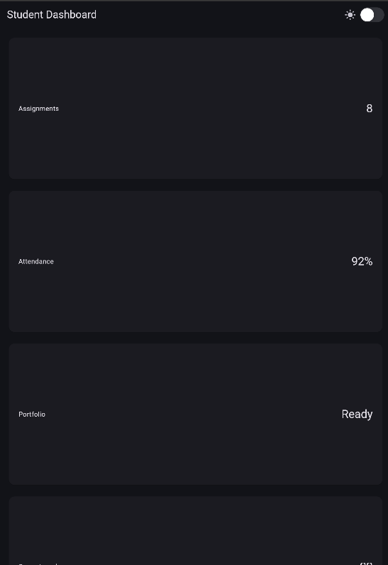

# Week 02 | Declarative UI & Responsive Design

## Simple Profile

Result

## StatefulWidget dan Cupertino Interaction

## Layout Experiment

1. Change breakpoint from 700 to other value and observe the change
- Breakpoint 700 in Ipad air 
- Breakpoint 900 in Ipad air  when we increase the breakpoint from 700 to 900 on larger display in this example ipad air, it will stay at 1 column for much longer until we change it to much larger display, then it will turn to 2 column, and it will work on reverse if we change the breakpoint smaller

2. Change themeMode to ThemeMode.dark, and to themeMode.system
-  
-  in this device, since the system is set to dark, so there are no difference between dark and system theme

3. Test your app with different emulator screen size
- Iphone 12 pro size (390x844) 
- Ipad air (820x1180) 

4. Add semantics or label that is important in screen reader
- I added semantics label `Togle dark mode` 