# Week 03 | Navigation & State Management
## Practicum 1 - Multi page Application and GoRouter

 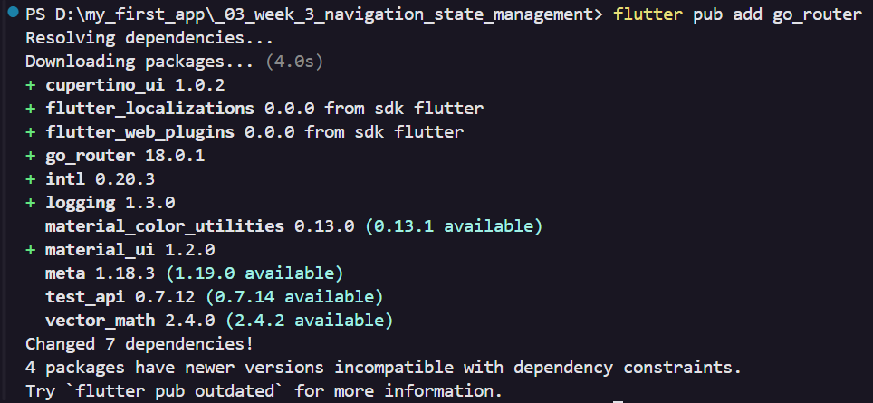
 
 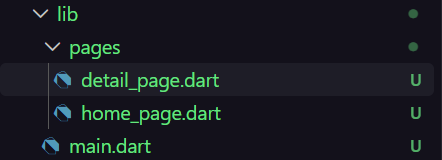

Result Practicum 1 Iphone 12 Pro Max Display
 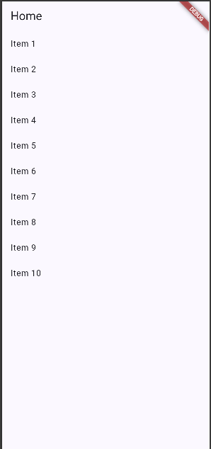

Routing
 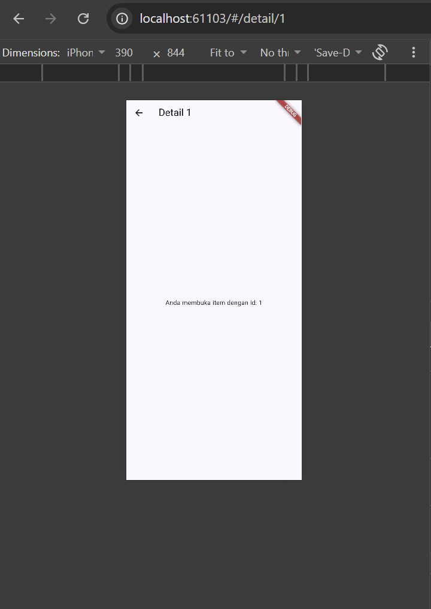

 ## Practicum 2 - State management with Riverpod
 
 Result

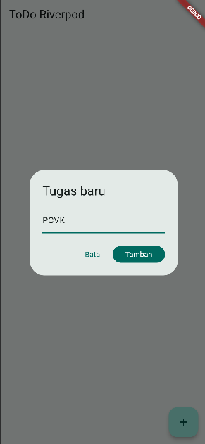

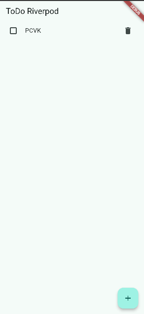

## Practicum 3 - State Test
### 1.

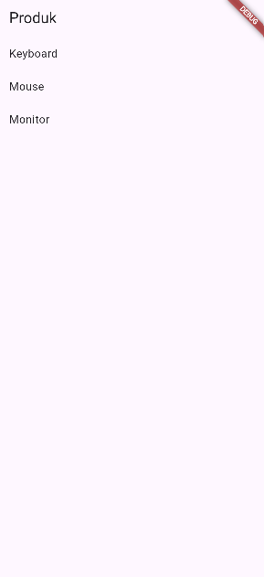

### 2. Change `build()` temprarily to throw error: throw `Exception('Gagal terhubung ke server');`. Run and observe UI error and the try again button 

### 4. Why displaying stale data with a refresh indicator is often better than clearing the screen

1. Preserves UI Continuity & Context:
Wiping the screen clear when a refresh occurs creates a "flash of empty space" or sudden layout shift. Retaining previously loaded data lets the user keep reading while fresh data fetches in the background.

2. Improves Perceived Performance:
Apps feel significantly faster when content remains visible. Waiting on a spinner while looking at data feels shorter than waiting on a full-screen loading wheel in front of a blank backdrop.

3. Graceful Fallback on Connection Failure:
If a user attempts to refresh on a weak mobile network and the update fails, showing stale data keeps the app usable with loaded information. Clearing the screen leaves the user stranded on a full-screen error widget with zero usable content.

The Pattern is importan when loading feeds and using dashboard, also in unstable or low badwith networks

## AI Challange

### AI Verification Checklist

#### 1. Are states modified immutably (no direct `state.add()` or list mutation)?
The state is handled immutably, using Riverpod's `AsyncNotifier`. Instead of mutating an existing list (like using `state.add()`), the `build()` method fetches the data and returns a completely new `List<StatItem>`. Riverpod automatically wraps this returned list in an immutable `AsyncData` state.

#### 2. Is `ref.watch` only used inside the `build` method, and `ref.read` used in callbacks?
Yes. In the `StatsPage`, `ref.watch(statsNotifierProvider)` is placed directly inside the `build` method to listen for state changes. Inside the onPressed callback of the retry button, `ref.invalidate(statsNotifierProvider)` is used, rather than improperly using `ref.watch` inside a function.

#### 3. Are all three AsyncValue states properly handled (not just the success state)?
Yes. The UI fully implements the `statsAsync.when()` method, which provides UI states for all three scenarios, loading, error, data

#### 4. Are the providers declared with explicit types and not duplicated with other providers?
Yes. The providers are declared explicitly. This ensures type safety, and the provider is declared globally as a singleton, meaning there are no duplicate provider declarations

#### 5. Does the AI code use outdated Riverpod APIs (`StateProvider` anti-pattern, deprecated `StateNotifierProvider`, or unnecessary nested `Consumer`)? Fix it to the `Notifier`/`ConsumerWidget` pattern.
No, the code uses the modern API. The code follows the modern Riverpod 2.x architecture

#### 6. `flutter analyze` and `flutter test`
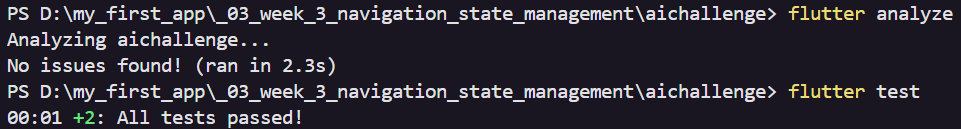

## Refactoring Challenge
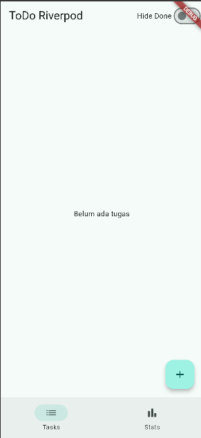

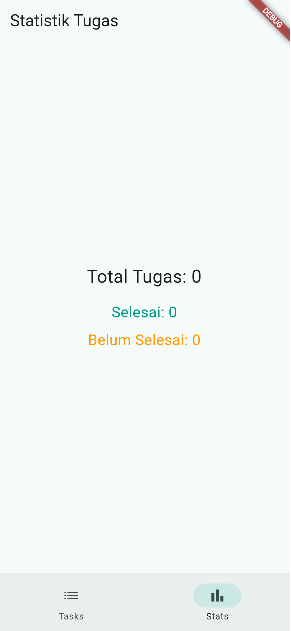

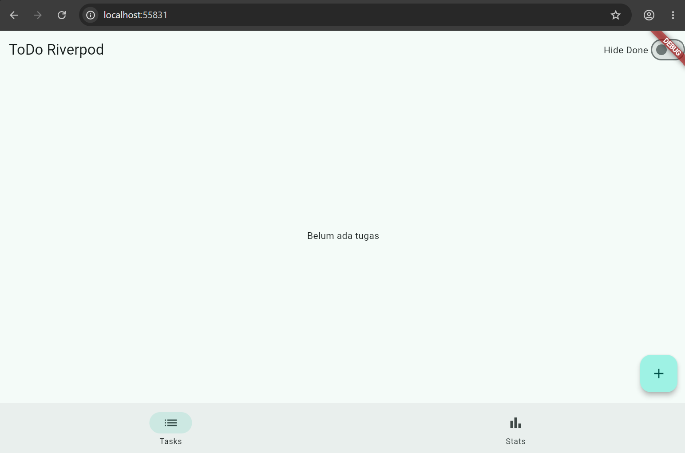

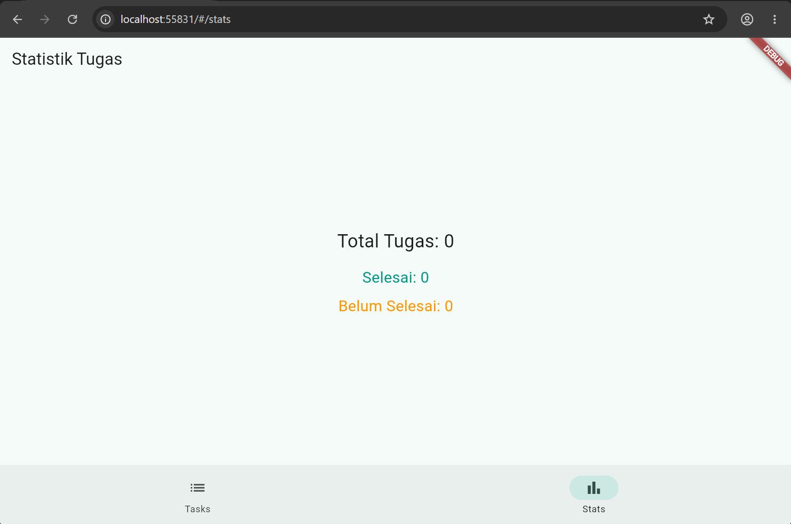

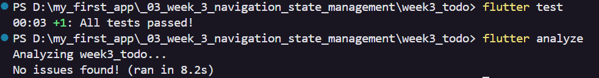

## Assignment
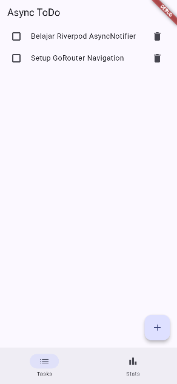

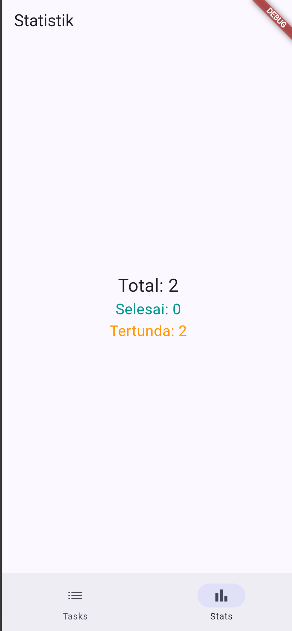

## Reflection

### 1. When is `setState` is enough, and when does `staet` needs to be `Riverpod`
Use `setState` for local UI state that only one widget cares about. Move state to Riverpod when the data needs to be shared across multiple screens, or when the state is complex and asynchronous

### 2. What is the difference of `context.go` and `context.push`, and when each of them is used?
`context.go` replaces the current navigation stack and jumps directly to a new route, which is ideal for switching main tabs or returning home. `context.push` stacks the new page on top of the current one, preserving the back button, which is perfect for opening a detail page from a list

### 3. How does `AsyncValue` prevent bug than the three separate boolean?
`AsyncValue` forces developers to handle all three states (`data`, `loading`, `error`) simultaneously using `.when()`. This eliminates impossible bugs, like having `isLoading == true` and `hasError == true` at the same time, which easily happens when managing three separate boolean variables manually

