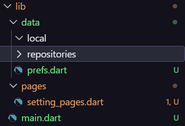
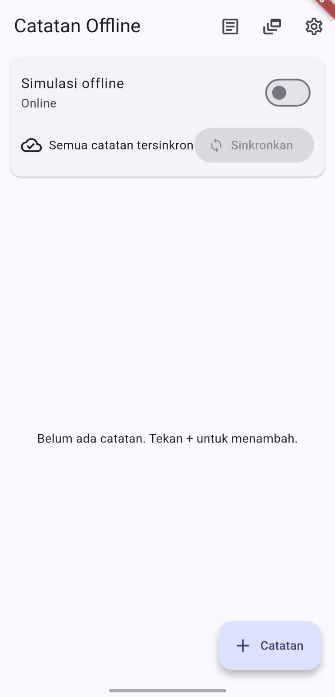
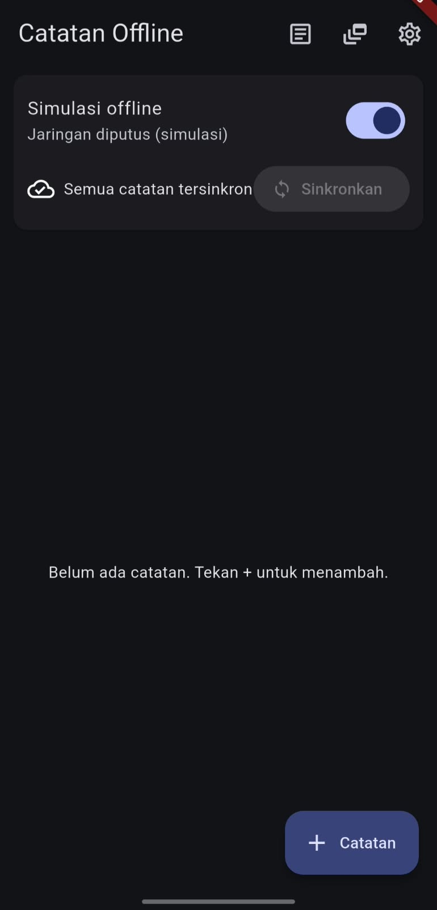
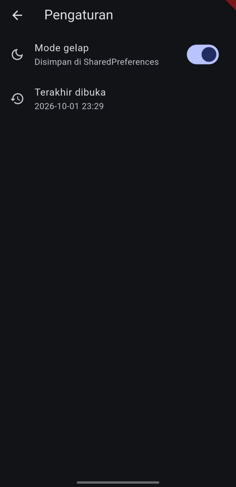
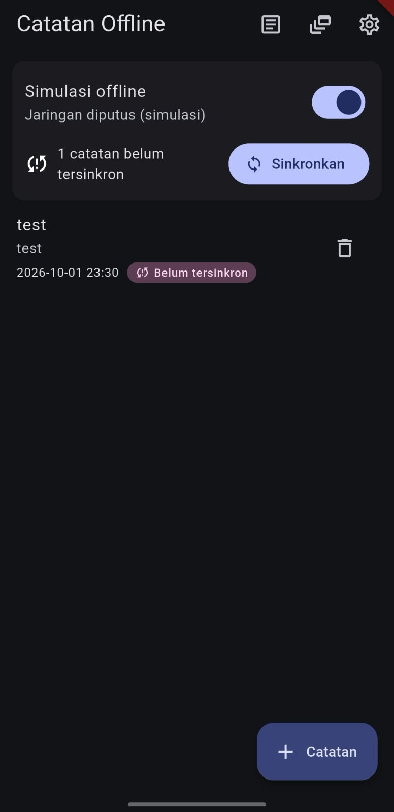
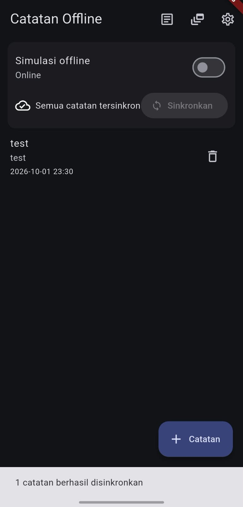
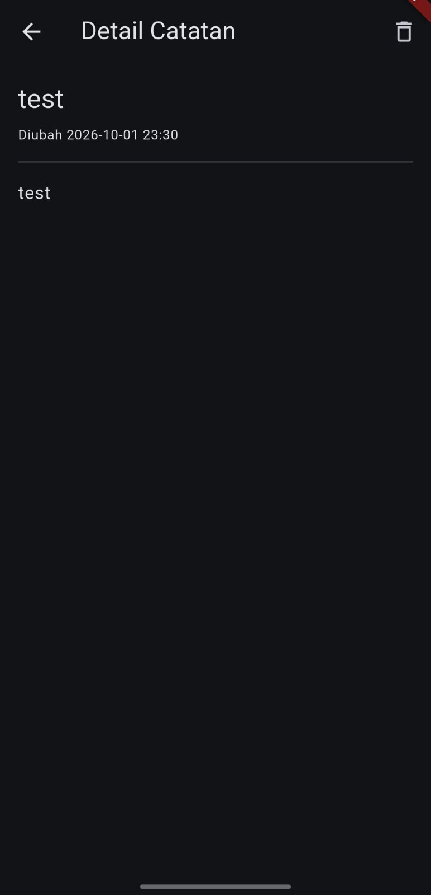

# Week 05 | Local Storage & Offline First
## Lab 1: SharedPreferences

## Lab 2: SQLite and the notes repository

## Lab 3: Cache-first and the sync queue

### Lightmode

### Darkmode

### Last Seen

### Image add and synchonize

### Detail Note

## Reflections
1. Why not SharedPreferences for notes?

SharedPreferences is designed only for small key-value pairs (like app settings). Storing a large list of notes requires serializing/deserializing massive JSON strings, which will block the main thread (causing UI freezes or ANRs), consume excessive memory, and make querying or sorting the data impossible. You should use a local database (like SQLite, Room, or Isar) instead.

2. Cache-first vs. Network-first:

Cache-first is sufficient for static or slow-changing data where fast loading and offline access are prioritized (e.g., past notes, user profiles, articles).

Network-first is required for volatile, time-sensitive data where showing stale data is dangerous (e.g., live stock prices, bank balances, or real-time seat bookings).

3. Dirty flags and the Outbox pattern:

A "dirty flag" (e.g., is_synced = false) allows a background worker (like WorkManager) to quietly query and upload un-synced rows on a separate thread, keeping the UI perfectly smooth. A separate outbox table becomes necessary when the exact order of operations matters (e.g., Create -> Update -> Delete), or when the sync action is a complex API request that doesn't map 1:1 to a single database row.
