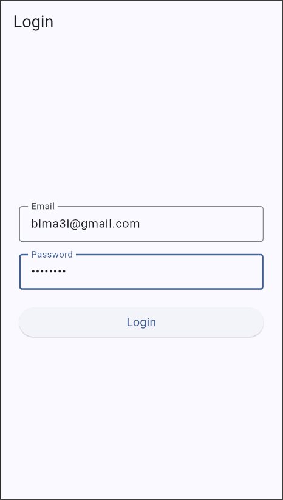
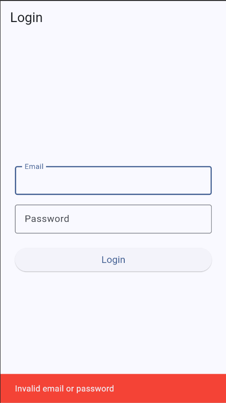
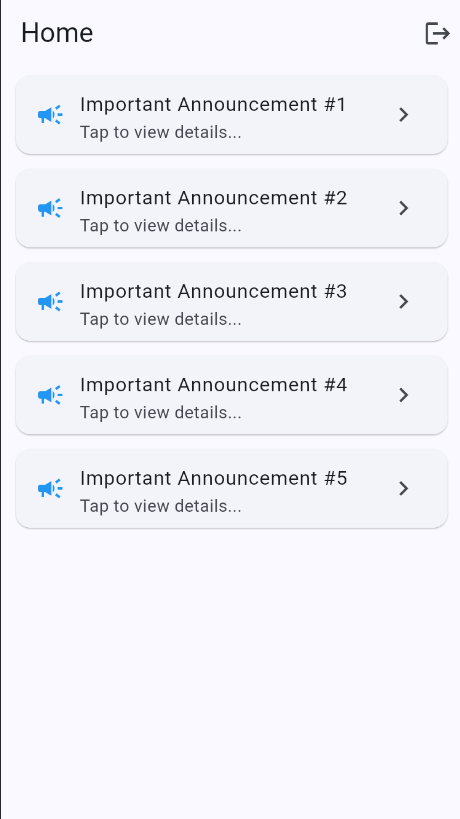
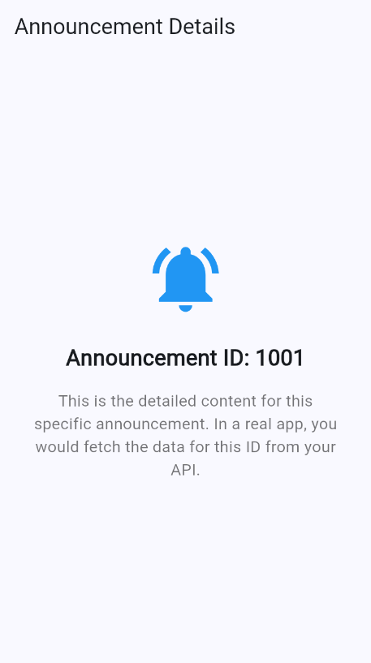
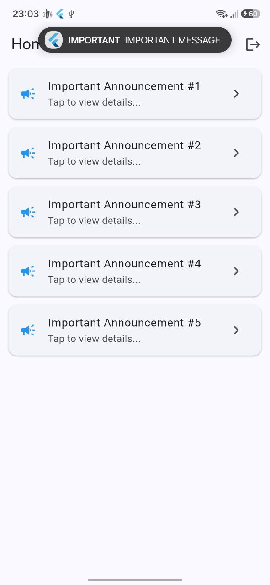
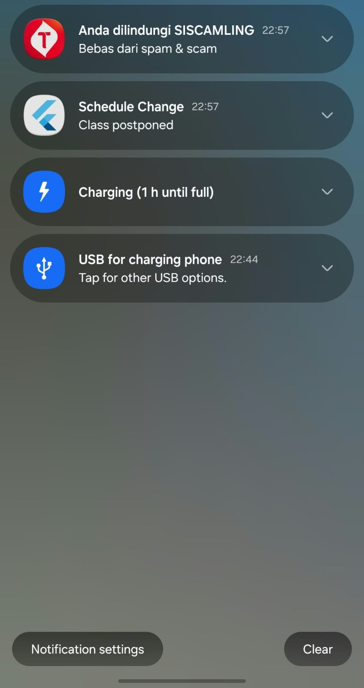

# Week 06 | Authentication, Security & FCM

## Lab 1: Login + secure storage + token refresh

Login Page

Invalid credential

Home page

Announcement page

## Lab 2: FCM, permission, and token lifecycle

## Lab 3: Payloads, three app states, clicks and topics

|State|Expected Behaviour|How to test|Status|
|---|---|---|---|
|Foreground|Local notification banner appears. Tapping it navigates to /announcement/3|App open on screen, send FCM message from console|PASSED|
|Background|	Android system notification banner appears. Tapping it opens app & routes to /announcement/3|Press Home button, send FCM message, tap notification|PASSED|
|Terminated|App launches from cold start|Close app completely, send FCM message, tap notification|PASSED|

## Reflections

### 1. Why must refresh tokens never live in SharedPreferences? What is the risk if one leaks?
SharedPreferences on Android stores data in unencrypted, plain-text XML files. Anyone with root access, a physical device connection, or backup extraction tools can read plain-text tokens. FlutterSecureStorage uses hardware-backed key encryption.
Is a leak happens, refresh tokens typically have long lifespans. If an attacker steals a refresh token, they can generate valid access tokens continuously without knowing the user's password, leading to persistent account takeover.

### 2. What breaks if onTokenRefresh is ignored for a whole semester?
FCM registration tokens periodically rotate or invalidate. If onTokenRefresh is ignored, the backend holds a stale token. Important push notifications sent to that device will fail silently

### 3. When do you use a topic vs a device token? Give one campus message example for each.
Topis is used for broadcasts to a group or all users without needing individual token management.
Campus Example: "Holiday: No-Class for the last week of December." (Topic: campus-announcement).
Device Token is used for targeted, sensitive, or user-specific notifications.
Campus Example: "Special Notifivation: Tuition for Bima is cleared." (Device Token).

### Which part of the AI draft did you reject or fix, and why?
Fixes:
Android 13+ Permission & Desugaring: Initial AI boilerplate omitted POST_NOTIFICATIONS in AndroidManifest.xml and isCoreLibraryDesugaringEnabled in Gradle. Without these, builds fail or notifications are blocked silently on Android 13+.
